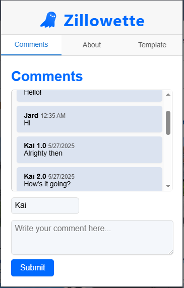

# Zillowette

#### By Kai Turanski

_[WIP - Planned release in July 2025]_

Chrome extension that allows you to comment on zillow posts. Inspired by Hank Green's [tweet](https://x.com/hankgreen/status/1479509887373643780?lang=en) suggesting that zillow should have comments.

Name inspired by [Peter Corless](https://x.com/PeterCorless/status/1479513004580360196) on twitter.

#### Licenced with the [GNU General Public License v3](https://choosealicense.com/licenses/gpl-3.0/)

